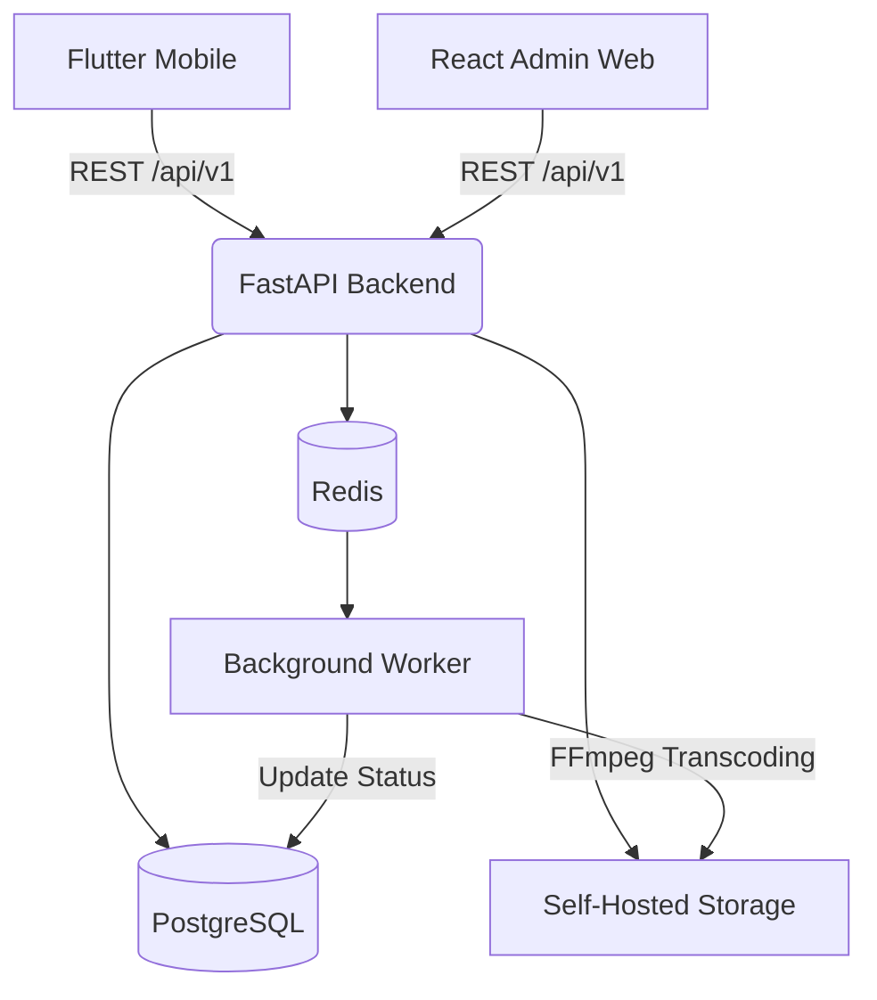

# Edify Ecosystem Implementation Plan

This plan details the phase-wise implementation of the complete Edify ecosystem, comprising the FastAPI backend, the React (Vite) Admin Dashboard, and the Flutter mobile application. The approach breaks down the architecture into manageable, incremental phases, prioritizing a solid foundation and moving audit infrastructure early in the process.

> [!IMPORTANT]
> ## User Review Required
> Please review the updated architecture and phased breakdown below. If you approve, we will begin execution with **Phase 0** and **Phase 1**, focusing on setting up the monorepo and the backend foundation.

> [!NOTE]
> ## Open Questions
> 1. **Authentication Flow**: Should we start with standard Email/Password first and add Google OAuth later, or tackle both simultaneously during the Authentication phase?

---

## 🏗️ Architecture Overview

The business architecture remains centered around a robust REST API backend communicating with our clients.



### 📱 Mobile (Flutter)
- **Framework**: Flutter + Dart
- **State Management**: Riverpod
- **API Client**: Dio
- **Navigation**: GoRouter
- **Audio**: `just_audio` + `audio_service`

### 🖥️ Admin (React + TypeScript)
- **Framework**: React (Vite) + TypeScript
- **Routing**: React Router
- **Server State**: TanStack Query
- **Forms**: React Hook Form + Zod
- **Styling**: Tailwind CSS

### ⚙️ Backend (FastAPI)
- **Framework**: FastAPI (Python)
- **Package Manager**: uv
- **Task Runner**: Just
- **ORM & DB**: SQLAlchemy 2.x, Alembic, PostgreSQL
- **Cache**: Redis
- **Auth**: JWT + Google OAuth + Argon2id
- **Storage**: Self-hosted filesystem
- **Infrastructure**: Docker Compose, Caddy (Proxy)

---

## 📁 Project Structure

We will use a unified monorepo structure:

```text
edify/
│
├── backend/                  # FastAPI Application
│
├── mobile/                   # Flutter Application
│   ├── lib/
│   │   ├── core/             # config, errors, network, storage, utils
│   │   ├── features/         # auth, home, search, songs, player, etc.
│   │   ├── shared/           # widgets, models
│   │   ├── routing/
│   │   └── main.dart
│   ├── test/
│   └── pubspec.yaml
│
├── admin-web/                # React Admin Application
│   ├── src/
│   │   ├── app/              # router, providers, config
│   │   ├── features/         # auth, dashboard, songs, audit, etc.
│   │   ├── components/       # ui, layout, tables
│   │   ├── api/              # client, endpoints
│   │   └── main.tsx
│   ├── public/
│   └── package.json
│
├── infrastructure/           # Deployment & DevOps
│   ├── docker/
│   ├── caddy/
│   └── scripts/
│
├── docs/                     # Documentation
│   ├── architecture/
│   ├── api/
│   ├── database/
│   └── development/
│
├── docker-compose.yml
├── Justfile                  # Command shortcuts
├── .gitignore
└── README.md
```

---

## 🔄 Proposed Implementation Phases

*Note: Audit infrastructure has been moved earlier to ensure all initial admin operations (e.g., uploading music) are securely logged from day one. The plan is structured around deliverable milestones (V1 to V5).*

### 🎯 Milestone 1: Edify V1 (The MVP)
*Goal: A working end-to-end system for login, music management, audit logging, and streaming.*

- **Phase 0: Project Setup**
  Initialize the monorepo, configure Docker with PostgreSQL and Redis, and scaffold the FastAPI, React Admin, and Flutter apps.
- **Phase 1: Backend Foundation & DB**
  Set up FastAPI, SQLAlchemy, Alembic. Define core user and auth database schemas.
- **Phase 2: Authentication & Audit Logging**
  Implement JWT auth (Email/Password & Google). Build the `AuditService` to start tracking all critical actions immediately.
- **Phase 3: Music Catalog, Storage & Transcoding API**
  Define music models (artists, albums, songs, `song_audio_variants`). Implement the upload pipeline (ID3 metadata, async storage), the FFmpeg Redis worker to generate 64k/128k/256k variants, and the HTTP Range streaming API with `?quality=` support.
- **Phase 4: React Admin Web V1**
  Build the admin dashboard to handle logins, upload music, manage the catalog, view audit logs, and monitor transcoding job statuses.
- **Phase 5: Flutter Mobile App V1**
  Implement user login, browsing/searching the catalog, and the core audio player (`just_audio`). Add quality selection capabilities (Auto/Low/Medium/High/Original).

### 🎵 Milestone 2: Edify V2 (Personalization)
*Goal: User engagement through likes, playlists, and listening history.*

- **Phase 6: Personalization Backend**
  Build APIs and DB models for `liked_songs`, `playlists`, `playlist_songs`, and `song_play_events`.
- **Phase 7: Flutter Personalization UI**
  Implement the "Library" screen, allow users to create playlists, like songs, and track what they've recently played.

### 📊 Milestone 3: Edify V3 (Analytics & Audit Improvements)
*Goal: Deep insights into system usage and listening habits.*

- **Phase 8: Data Aggregation**
  Process play events into analytics endpoints (listening time, most played songs, top artists).
- **Phase 9: Admin Analytics Dashboard**
  Update the React Admin app with charts for listening statistics and enhance the audit log viewer with advanced filtering.

### 🤖 Milestone 4: Edify V4 (Recommendations)
*Goal: Help users discover music.*

- **Phase 10: Recommendation APIs**
  Build basic recommendation logic based on listening history, liked songs, and recently played tracks.
- **Phase 11: Flutter Discovery UI**
  Add "Made For You" sections and dynamic feeds on the Flutter Home screen.

### 📱 Milestone 5: Edify V5 (Advanced Player & Offline)
*Goal: Polishing the mobile experience and securing production.*

- **Phase 12: Offline Playback**
  Implement song downloading and secure local storage in the Flutter app so users can listen without an internet connection.
- **Phase 13: Advanced Player Features**
  Add synchronized lyrics, equalizer settings, and advanced queue management.
- **Phase 14: Hardening & Production Deployment**
  Write automated tests across the stack, configure the Caddy reverse proxy, finalize Docker deployment, and implement automated backup strategies.
